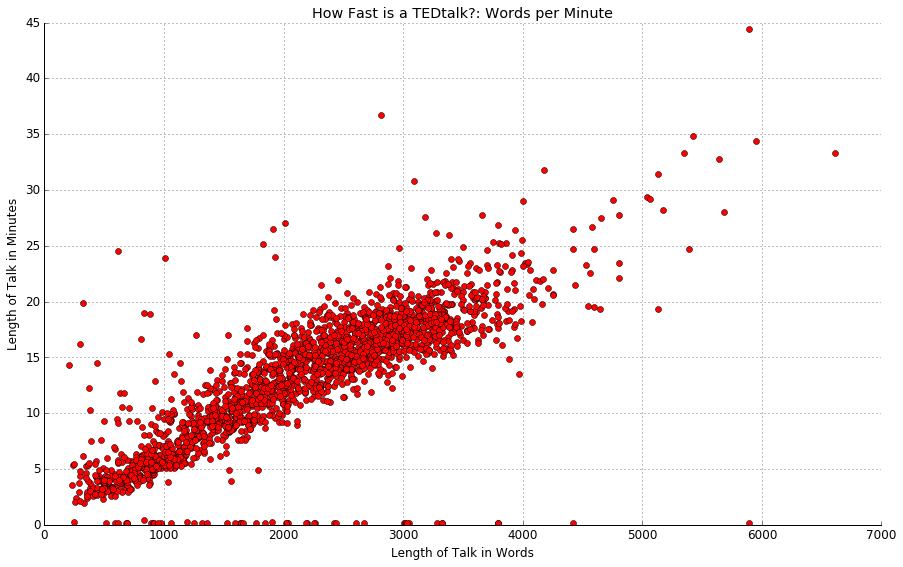

# Lab Notes

Okay, we need an infrastructure both for drafting as well as for communicating with each other outside of emails, code, or video. It's one way to capture not only for you but also for me some of the things I encounter without having a lot of clutter in the Jupyter notebooks, if we pursue those as a collaborative option.

## TO DO: 

- [ ] Compare the most frequent words here against established stopword lists to see what a TED talk stoplist would look like.
- [ ] Create lexical diversity measure for all texts. Since lengths are fairly comparable, TTR will be, I think, good enough.
- [x] Create a list of all the empty or "bad" texts.

- [ ] See what affect stemming has -- though this shouldn't be a high priority since stemming seems to be debatable. >>> I decided to skip this in favor of seeing how things turn out unstemmed first.

## 2017-01-29

What I've been working on for the past few days is in preparation for attempting a topic model using the more established LDA instead of the NMF to see how well they compare -- with the understanding that since there is rarely a one-to-one matchup within either method, that there will be no such match across them.

Because LDA does not filter out common words on its own, the way the NMF method does, you have to start with a stoplist. I know we can begin with Blei's and a few other established lists, but I would also like to be able to compare that against our own results. My first thought was to build a dictionary of words and their frequency within the corpus. For convenience sake, I am using the NLTK. 

Just as a record of what I've done, here's the usual code for loading the talks from the CSV with everything in it:

```python
import pandas
import re

# Get all talks in a list & then into one string
colnames = ['author', 'title', 'date' , 'length', 'text']
df = pandas.read_csv('../data/talks-v1b.csv', names=colnames)
talks = df.text.tolist()
alltalks = " ".join(str(item) for item in talks) # Solves pbm of floats in talks

# Clean out all punctuation except apostrophes
all_words = re.sub(r"[^\w\d'\s]+",'',alltalks).lower()
```


We still need to identify which talks have floats for values and determine what impact, if any, it has on the project.

```python
import nltk

tt_tokens = nltk.word_tokenize(all_words)

tt_freq = {}
for word in tt_tokens:
    try:
        tt_freq[word] += 1
    except: 
        tt_freq[word] = 1
```

Using this method, the dictionary has 63426 entries. Most of those are going to be single-entry items or named entities, but I do think it's worth looking at them, as well as the high-frequency words that may not be a part of established stopword lists: I think it will be important to note those words which are specifically common to TED Talks.

I converted the dictionary to a list of tuples in order to be able to sort -- I see that there is a way to sort a dictionary in Python, but this is a way I know. Looking at the most common words, I see NLTK didn't get rid of punctuation: I cleared this up by removing punctuation earlier in the process, keeping the contractions (words with apostrophes), which the NLTK does not respect. 

**N.B.** I tried doing this simply with a regex expression that split on white spaces, but I am still seeing contractions split into different words. 

```python
tt_freq_list.sort(reverse=True)
tt_freq_list[0:20]

[(210294, 'the'),
 (151163, 'and'),
 (126887, 'to'),
 (116155, 'of'),
 (106547, 'a'),
 (96375, 'that'),
 (83740, 'i'),
 (78986, 'in'),
 (75643, 'it'),
 (71766, 'you'),
 (68573, 'we'),
 (65295, 'is'),
 (56535, "'s"),
 (49889, 'this'),
 (37525, 'so'),
 (33424, 'they'),
 (32231, 'was'),
 (30067, 'for'),
 (28869, 'are'),
 (28245, 'have')]
```

Keeping the apostrophes proved to be harder than I thought -- and I tried going a "pure Python" route and splitting only on white spaces, trying both of the following: 

```python
word_list = re.split('\s+', all_words)
word_list = all_words.split()
```

I still got: ` (56535, "'s"),`. (The good news is that the counts match.)

Okay, good news. The NLTK white space tokenizer works:

```python
from nltk.tokenize import WhitespaceTokenizer
white_words = WhitespaceTokenizer().tokenize(all_words)
```

I tried using Sci-Kit Learn's `CountVectorizer` but it requires a list of strings, not one string, **and** it does not like that some of the texts are floats. So, we'll save dealing with that when it comes to looking at this corpus as a corpus and not as one giant collection of words.

```python
from sklearn.feature_extraction.text import CountVectorizer

count_vect = CountVectorizer()
word_counts = count_vect.fit_transform(talks)

ValueError: np.nan is an invalid document, expected byte or unicode string.
```

The final, working, script of the day produces the output we want:

```python

# Tokenize on whitespace
from nltk.tokenize import WhitespaceTokenizer
tt_tokens = WhitespaceTokenizer().tokenize(all_words)

# Build a dictionary of words and their frequency in the corpus
tt_freq = {}
for word in tt_tokens:
    try:
        tt_freq[word] += 1
    except: 
        tt_freq[word] = 1

# Build a list of tuples, sort, and see some results 
tt_freq_list = [(val, key) for key, val in tt_freq.items()]
tt_freq_list.sort(reverse=True)
tt_freq_list[0:20]
```


## 2017-01-31

A quick check of the length of the vocabulary set (`len(tt_freq_list)`) for the TED Talks using the NLTK method reveals a total vocabulary of unique words of 56,714.[^1] The total word count for the corpus (`len(all_words)`) is 24,117,574. A raw lexical diversity figure (Type-to-Token Ratio, or TTR) would be: 

```python
lex_diversity = round(len(tt_freq_list) / len(all_words), 4)
print("Lexical diversity: {}".format(lex_diversity))

Lexical diversity: 0.0024
``` 
This is for the entire corpus: it would be interesting to see that on a per-text basis and to see which texts are most/least diverse and also to see if their is any tendencies by gender, discipline, etc. (Can we determine a list of those *et cetera*s?)


## 2017-02-01

Results of counting stopword lists:

```python
stop_words has 174 words 
the NLTK has 153 words 
the TedTalk list has 302 words 
the MALLET list has 525 words 
the Blei list has 297 words
```

Again, I don't have notes for the TEDtalk list, so I'm going to throw this list out for the time being. (I am appending "_old" to the file name.)

A bit more work comparing stopword lists, and I have a base list determined:

```python
import re

tt_stoplist = re.split('\s+', open('../data/tt_stop.txt', 'r').read().lower())
print("tt_stop has {} words".format(len(tt_stoplist)))

tt_stop has 351 words
```

## 2017-02-02: Compiling a List of the "Bad" Texts

I am beginning with the following code that KK wrote to find those talks that were not strings:

```python
# We establish which talks are empty
i = 0
no_good = []
for talk in talks:
    A = type(talk)
    B = type('string or something')
    if A != B:
        no_good.append(i)
    i = i + 1

print(no_good)

[185, 398, 513, 877, 1015, 1100, 2011]
```

In `pandas` in addition to being able to filter rows, you can also select by position. It looks a lot like slicing in lists. (You can do this two dimensionally as well.) **N.B.** Another way to do this would have been to filter by `NaN` but I already had the list above so I went with this method.

```python
df.iloc[no_good]
```

author |	title	| date	| length	| text
-------|------------|-------|-----------|---------
185	| Quixotic Fusion	| Dancing with light	| Jun 2012	| 718	| NaN
398	| Bruno Maisonnier	| Dance, tiny robots!	| Feb 2013	| 74	| NaN
513	| Kenichi Ebina	    | My magic moves	    | Oct 2007	| 204	| NaN
877	| Aakash Odedra	    |A dance in a hurricane of paper, wind and light	| Dec 2014	| 573	| NaN
1015 | Joey Alexander	| An 11-year-old prodigy performs old-school jazz	| Jun 2015	| 372	| NaN
1100 | Kaki King | A musical escape into a world of light and color	| Nov 2015	| 671	| NaN
2011 | Robert Gupta + Joshua Roman	| On violin and cello, "Passacaglia"	| May 2011	| 526	| NaN

A visual inspection of the CSV file confirmed the lack of text in each of these rows. A quick check of the TED website found the following:

* 185: Yup, no words.
* 398: No transcript on website. 3:00 long.
* 513: No transcript. 3:28.
* 877: No transcript. 9:50.

I performed a similar operation to determine texts that might be too short to contribute to a topic model and other measures of texts. I simply ball-parked 1000 characters -- because in a previous moment of graphing I had seen numbers in the 200s -- and 21 texts turned up:

```python
j = 0
too_short = []
for talk in talks: 
    if len(str(talk)) < 1000:
        too_short.append(j)
    j = j + 1

print(len(too_short), too_short)

21 [115, 185, 331, 398, 513, 877, 982, 1015, 1100, 1299, 1342, 1427, 1641, 1846, 1852, 1937, 1947, 2011, 2028, 2080, 2102]
```

I inspected the CSV itself, `../data/talks-v1b.csv`, again, and these results are confirmed.

So, now, with a stopword list and the empty talks or the too short talks all identified, we are ready to proceed with a topic model...

***Before*** moving on, I decided to clean up the `docs/` directory. It's a mess of my own making. There's a fair amount of duplication in there, and, to be honest, the markdown version of the notebooks aren't working in terms of keeping the code and the text explanations clearly separated. (Plus, GitHub now supports the display of Jupyter Notebook pages.)

## 2017-02-03 - LDA Topic Model

The topic model work begins with our standard loading of a `pandas` dataframe from the CSV:

```python
import pandas
import re

# Create pandas dataframe
colnames = ['author', 'title', 'date' , 'length', 'text']
df = pandas.read_csv('../data/talks-v1b.csv', names=colnames)
```

Once this is done, you can filter various columns into lists using the `list =  df.column.tolist()` expression: 

```python
talks = df.text.tolist()
authors = df.author.tolist()
dates = df.date.tolist()
```
**N.B.**: *I'm doing it this way because I know how to feed a list of strings into the topic modeling libraries. There may very well be another way to get the date out of the dataframe and into the topic models.*

After this, I pulled out the years using some regex and then zipped the years back with the authors to create what looks like an autho-date citation. I then ran a quick check to make sure things are still in sync:

```python
cited_texts.head()
```

  | citation	          | text
--|-----------------------|------------------------------------------
0 | Al Gore 2006	      | Thank you so much Chris. And it's truly
1 | David Pogue 2006	  | Hello voice mail my old friend. 
2 | Cameron Sinclair 2006 | I'm going to take you on a journey 
3 | Sergey Brin + Larry Page 2007 | Sergey Brin I want to discuss a question
4 | Nathalie Miebach 2011 | What you just heard are the interactions

Now, all the work on determining empty or too short talks get re-called from the file `drop_talks.txt` and loaded into a list. I combined the usual file open into a list comprehenshion in order to convert the numbers being stored as strings into integers. Essentially, I took `numbers = [ int(x) for x in numbers ]` and replaced the `open()` sequence inside the comprehension. And ... it works! (Not sure how Pythonic it is.)

```python
the_bad = [ int(x) for x in open("../data/drop_talks.txt", "r").read().split('\n') ]
```

And then it's time to use KK's backwards technique to keep the indices in place:

```python
for index in sorted(the_bad, reverse=True):
    del talks[index]
```

However, this throws off our pairing, so what we need to do is filter out the rows in the dataframe before creating the lists above. Here's my plan:

* Filter the rows using the index
* Save the new dataframe as a CSV file
* Start with this dataframe as the basis for the work.

First, grab the list of empty or too short talks:

```python
the_bad = [ int(x) for x in open("../data/drop_talks.txt", "r").read().split('\n') ]
```

Second, reverse the order just to be safe:

```python
dab_eht = sorted(the_bad, reverse=True)
```

Now, to purge the dataframe: I need to remove these rows. An example on Quora seems short and to the point:

> In the example below, the rows 1,3,5, and 7 are removed.
> `iris.drop(iris.index[[1,3,5,7]])`

So I'm going to try the following:

```python
df_purged = df.drop(df.index[dab_eht])
```

A quick comparison of the two dataframes: `df[184:187]` versus df_purged[183:186] shows that the operation was successful. (And that the row numbering remains unchanged such that the rows are 184 .. 186 in the new dataframe.)

Saving is simple:

```python
df_purged.to_csv('../data/talks_2.csv')
```

**N.B.**: Apart from the dropped lines, there was another difference between these two files: `talks_2` had the names of the headers written in the first line: `,author,title,date,length,text`. For the sake of simplicity and congruence with the earlier files, I removed the first line (by hand).

Okay, so we need a couple of things going in:

1. We need to use our custom stopword list, `tt_stop.txt`. 
2. We want to use the NLTK tokenizer because it preserves contractions with our terms and so we will need a `for` loop to turn each of the talks as strings into a talk as a list and then understand how to feed that list into the LDA implementation.

So here's a test set of documents, which includes a contraction:

```python
doc_a = "You can call me Al."
doc_b = "I can call you Betty."
doc_c = "Who'll be my role model?"

doc_set = [doc_a, doc_b, doc_c]
```

And here's the loop (uncommented): 


```python
for i in doc_set:
    raw = i.lower()
    tokens = tokenizer.tokenize(raw)
    stopped_tokens = [i for i in tokens if not i in stopwords]
    texts.append(stopped_tokens)

print(texts)
[['call', 'al.'], ['call', 'betty.'], ["who'll", 'role', 'model?']]
```

Oops! Other punctuation is showing up. This change to the `raw` line in the loop clears that problem:

```python
raw = re.sub(r"[^\w\d'\s]+",'', i).lower()
```

## 2017-02-04

The working code for the LDA model is, I think, reasonably clear and clean. What it doesn't have built into it, and I have seen other examples that do this, is removal of low-frequency words -- thresholds are variable -- but since most topic models are represented as words that co-occur, I don't know that worrying about the low-freq words is worth the trouble.

A lot of what is at the end of the LDA notebook right now is a variety of attempts to print out the data in the LDA model so that I can also understand how it's stored and how to output it in ways that we can do other things with it. For now, there's a simple for loop that simply makes it easier to copy and paste the output into a CSV -- I know we could write code to do this, but I got lazy at this moment. 

- [ ] Getting the rich data in the LDA model outputted in a fashion where we can do other things with it is a higher priority.

## 2017-02-07

Okay, with the LDA code working and tested with 25 topics after 10 passes, I ran the code a couple of times with 35 topics and 100 passes -- this took about 5 to 10 minutes on my MacBook Pro, so be prepared to make a cup of coffee.

I checked the 35 LDA topics against those produced by NMF: the NMF looks better. I'm not really sure on the LDA topics at all. I will try it again without the stopwords coming out to see if the results are more in-line with the NMF method.

And the NMF code is a lot faster than the LDA code (at least the `gensim` implementation). 


## 2017-02-14

The differences between the LDA and the NMF results continued to haunt me, making me wonder if there wasn't some work to be done, basic work, on the vocabulary of the corpus. 

- [ ] Here we could probably use a refresher/primer on the basics of vocabulary versus lexicon. Words versus tokens is easy. I'm a little less clear on the nature of word-forms -- e.g., stem, stemmed, stemmer, stemming. 

Single instances of a token: 19855.

Looking more closely, keeping apostrophes, in order to keep contractions intact, appears to have been a mistake. For example, it's not entirely clear how one instance of *avatar* got wrapped in single quotation marks. 

Line  | Count | Token
------|-------|----------
6115  | 40    | avatar
12420 | 13    | avatars
55350 |  1    | avatar's
56700 |  1    | 'avatar'

*The line numbers are from `./outputs/tt_freq.csv`.*

Out of 55 instances, however, only 2 have been generated by keeping quotations, so it's not a huge number in this instance. Single and plural, however, might be worth examining, but my guess is that in most cases, single and plural forms will take place within a single document, so I don't think stemming here will necessarily give us any better results. 

Some more counts:

Frequency| Number of Words with that Frequency
---------|----------------
   1	| 19855
   2	|  7691
   3	|  4406
   4	|  3099
   5	|  2175
   6	|  1673
   7	|  1283
   8	|  1087
   9	|   927
  10	|   767
  ...	|  ...
  100	|    19

  The words that occurred 100 times are an interesting mix:
  
  > uncomfortable, stations, stanford, pink, paintings, operations, nobel, neighborhoods, mechanics, layers, investing, gut, gang, frequency, focusing, engagement, cry, concern, ate
  
At the next log point of frequencies:

Count	|	Word
--------|------------
1019	|	decided
1018	|	study
1017	|	completely
1015	|	places
1012	|	exactly
1010	|	stories
1009	|	species
1006	|	night
1004	|	became
1002	|	somebody
1000	|	share
997		|	education
993		|	large
992		|	gets
992		|	against
990		|	model
988		|	nature
984		|	level
983		|	heart
982		|	society     

Just for the sake of knowing it, there are 67 words with a count of ten thousand or more, and of those five top 100,000 with *the* occurring 210,294 times.


## 2017-02-16

So why all this concern with vocabulary? To some degree, I think it's under-examined. I think I'd like to see us have a CSV file in the eventual official repo for this project that lists all the words and their frequency. (This is also how JSTOR does it.) It would be nice to compare vocabularies of different corpora to see which corpora have more in common. We have no ready way of knowing, for example, if TED talks have more in common with newspaper editorials, marketing materials, political discourse, academic discourse, etc. 

Okay, we can do such things. But let's get to the larger picture, and remind ourselves why we are doing this: we have ~2000 texts thare are for the most part between 500 and 4000 words in length.



The following dimensions are internal to the texts, which really comes down to their words in variety and in length:

* length
* vocabulary (and considerations like diversity)
* topics (which is shorthand for custom vocabularies)

The following dimensions are external to the texts but measurable via controled vocabularies:

* sentiment & intensity
* concreteness
* potentially irony (? See Joshi et al. 2016)

The following are non-textual dimensions which may in fact manifest in texts in either established ways or in ways that will suggest possibilities for future research. These are meta-textual features for which we have concrete data:

* gender of speakers
* discipline of speakers
* popularity of a given talk (via hits/views)
* possibly links from outside pointing in (I don't know how to do this.)

Here's what follows after this vocabulary stuff gets set aside:

1. Topics
	a. Overall topic distribution
	b. Topic distribution by year
	c. Assignment of top topics in each document
	d. While we're here, I think it owuld be interest to slice texts (perhaps into ten pieces) and see if topics shift within a talk. (My hypothesis is that the openings of TED talks will reveal a more generic topic before speakers get down to business. Later, if we get ahold of other kinds of talks -- if we continue this line of inquiry -- it will be interesting to see if this "orientation" moment is similar or different.)
2. Speakers


## 2017-02-21

My mantra for the morning: "My task is topics." (That's too alliterations for the price of one.) I'm running the lean version of the NMF code, `Tt-06-topics-NMF`. (An early error I caught in returning to and revising this part of the code is that the stopword list still pointed to the old one: the current, working, list is `tt_stop.txt`.)

An early hiccough is that the `sklearn` vectorizer does not accept lists, so I had to write a small for loop to put the texts back into strings. My apologies for the variable names:

```python
strungs = []
for text in texts:
    strung = ' '.join(text)
    strungs.append(strung)
```

It's still not happy:

```python
---> 13 tfidf_vectorizer = text.TfidfVectorizer(max_df = 0.95,
     14                                         min_df = 2,
     15                                         max_features = n_features)

AttributeError: 'list' object has no attribute 'TfidfVectorizer'
```

And here's what happened: the `for` loop documented above in today's entry displaced the `text` part of the sklearn import, which I changed for the sake of clarity to: 

```python
import sklearn.feature_extraction.text as sk_text
```

I'm very happy to report at the end of the day that this code works: we have our stop words, and we have our vocabulary showing up in the topics. The code runs and runs reliably. I ran the code with 30, 35, 40, 42, and 45 topics. At 30, it was hard to make out what some of the clusters meant, but it became easier as the number of topics increased. By the time I got to 45, it looked like some redundancies were beginning to emerge, so I dialed back to 42. I still think there are redundancies present, and so I am going to call the ideal number of topics for this corpus 40. It's entirely a human call, and I will attach the Numbers document with its multiple spreadsheets when I report this to KK.

(The output from the last run with 42 topics is in the current version of the notebook: you just need to double-click on the ellipsis below the cell to see the printout.)

... No luck on saving these results, but when I ran the 40 topics again, it comes up the same. (The topic ID numbers change, but everything else looks stable. Yay!)

- [ ] I'm going to leave this for you (KK) to save to an array.

## 2017-02-23 

I decided to set aside some time today to try to understand NMF. My initial reason is to be able to save the NMF outputs to a file -- probably as an array, but then I realized I understand very little about the internals of NMF, so why not ask more questions on this quiet Thursday?

My search was pretty general: `sklearn nmf`. 

The first page I read was a [SO post][]:

> I am applying nonnegative matrix factorization (NMF) on a large matrix. Essentially the NMF method does the following: given an m by n matrix A, NMF decomposes into A = WH, where W is m by d and H is d by n. The ProjectedGradientNMF method is implemented in Python package Sklearn. I would want the algorithm return both W and H. But it seems that it only returns H, not W. Applying the algorithm again to A.T (the transpose) could give me W. However, I would want to avoid computing it twice since the matrix ix very large. If you could tell me how to simultaneously get W and H, that would be great!

The included code:

```python
from sklearn.decomposition import ProjectedGradientNMF
import numpy
A = numpy.random.uniform(size = [40, 30])
nmf_model = ProjectedGradientNMF(n_components = 5, init='random', random_state=0)
nmf_model.fit(A)
H = nmf_model.components_.T
```

The upvoted response notes that:

> [In] `fit_transform()` [...] H gets attached to components_ and W is returned from the function. So you shouldn't have to run this twice, you should just change:
> 
```python
nmf_model.fit(A);
H = nmf_model.components_.T;
```
> 
> to
> 
```python
W = nmf_model.fit_transform(A);
H = nmf_model.components_;
```

I had to remind myself what `W` and `H` are: the factor matrices of matrix V, which, when multiplied, approximately reconstruct the original matrix, usually referred to as `V`, but sometimes as `D`. In regards to text mining, the Wikipedia entry on NMF notes that: "In this process, a *document-term matrix* is constructed with the weights of various terms (typically weighted word frequency information) from a set of documents. This matrix is factored into a *term-feature* and a *feature-document* matrix."

Elsewhere, In terms closer to the NMF implementation: The original D matrix is approximated by the product of two low rank matrices: the Document-Topic matrix W and the Topic-Word matrix H. The rank of the matrices is defined by the number k of topics. wd(i,k) in W represents the importance of the topic k to the document i and wt(k,j) represents the importance of the term j to the topic k. 

Whenever I teach this, I need to remember to ground the idea of a *document-term matrix* in a very concrete way. For example, begin with the following four documents:

```python
D1 = "I like coffee."
D2 = "I hate coffee."
D3 = "I like cats."
D4 = "Cats hate coffee."
```

The first three can be represented in a very straightforward fashion in the following table:

ID | I | like | hate | coffee | cats
---|---|------|------|--------|------
D1 | 1 |   1  |  0   |    1   |  0
D2 | 1 |   0  |  1   |    1   |  0
D3 | 1 |   1  |  0   |    0   |  1

So far, so good. Words are being handled in the order they come, which seems very sensible. Only in a DTM texts are not strings of words so much as bags of words, such that the numbers need not be in the same order in which they occurred in the text so much as where they occur in the table. Thus, if we were to add D4 to out table, the sequence would be 0, 0, 1, 1, 1. As other documents (rows) get added to our table, we will add terms (columns). The order of the columns does not matter, only the relationship between the individual terms to the document. As the documents get longer and a term occurs more than once, then the numbers in the column reflect that. For instance, the document "I hate coffee, and I hate cats" would be represented by the line 2, 0, 2, 1, 1.

If we include all 5 documents and all five terms, we have a 5 x 5 matrix representation of our corpus:

```python
[[1 1 0 1 0]
 [1 0 1 1 0] 
 [1 1 0 0 1]
 [0 0 1 1 1]
 [2 0 2 1 1]]
```

*Note that this is Python's numpy representation of a matrix, since I don't have the giant square braces that normally represent matrices available here.*

Okay, so back to the sklearn NMF factorization module ... I need to see what the DTM looks like, but if I understand the above note correctly, it looks like I need to be able to save not only the DTM, as a matter of course, but also the *term-feature* and the *feature-document* matrices. (Well, I needed to port the NMF notebook into a script anyway, so here goes.)

While I have the notebook open, let's make sure to understand what's going on. I re-ran the code up until the moment of printing the topics with the following parameters

```python
n_samples = len(strungs)
n_features = 2000
n_topics = 40
n_top_words = 15
```

When we run `dtm.shape` we get `2092, 2000`, which means our 2092 documents have been assigned 2000 features. Previously, I used 1000 features, and the topics look a lot the same, but I think it's worth running with more features (3000, 4000, and 5000) as well as changing the `max_df` and `min_df` to see what how they affect output.

According to [a gist][], setting `mx_df` to 0.95 discards the 5% most frequent words, and Alan Riddell in his post on the Dariah website where he creates a topic model for Jane Austen novels doesn't use a `max_df` or `max_features` and sets the `min_df` at `20`. 


[SO post]: http://stackoverflow.com/questions/24739121/nonnegative-matrix-factorization-in-sklearn
[a gist]: https://gist.github.com/tgalery/3354850

***
## References

Fredrik deBoer, Evaluating the comparability of two measures of lexical diversity, System, Volume 47, December 2014, Pages 139-145, ISSN 0346-251X, http://dx.doi.org/10.1016/j.system.2014.10.008.

Joshi, Aditya, Pushpak Bjattacharyya, Mark Carman, Meghna Singh, Jaya Sraswati, and Rajita Shukla. 2016. How Challenging Is Sarcasm versus irony classification?: ana anlysis from human and computational perspectives. In Proceedings of Autralasian Language Technology Association Workshop, 134-138.


## Notes

[^1]: None of the tokens have been stemmed, so frequency and frequencies, for example, are counted separately. Stemming is not entirely a given in this work. [Frederik DeBoer][] notes in "Evaluating the Comparability of Two Measures of Lexical Diversity" that: "It’s enough to say here that in most computerized attempts to measure lexical diversity, such as the ones I’m discussing here, all constructions that differ by even a single letter are classified as different terms. In part, this is a practical matter, as asking computers to tell the difference between inflectional grammar and derivational grammar is currently not practical. We would hope that any valid measure of lexical diversity would be sufficiently robust to account for the minor variations owing to different forms." On inflectional grammar versus derivational grammar, note: "Inflection is the process of adding inflectional morphemes which modify a verb's tense or a noun's number, rarely affecting the word's meaning or class. Examples of applying inflectional morphemes to words are adding *-s* to the root dog to form dogs and adding *-ed* to wait to form waited. In English, there are eight inflections. In contrast, derivation is the process of adding derivational morphemes, which create a new word from existing words and change either the semantic meaning or part of speech of the affected word, for example by changing a noun to a verb." ([Wikipedia](https://en.wikipedia.org/wiki/Inflection#Inflection_vs._derivation))

[Frederik DeBoer]: http://fredrikdeboer.com/2014/10/13/evaluating-the-comparability-of-two-measures-of-lexical-diversity/