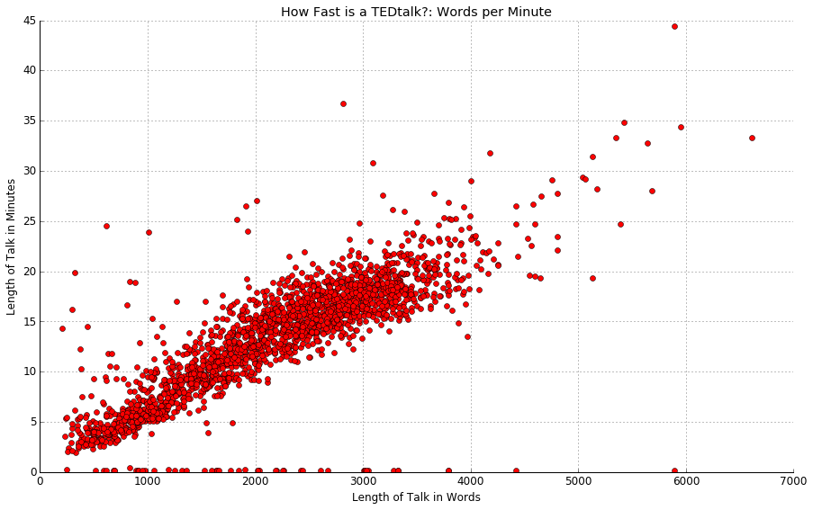

# Lab Notes

Okay, we need an infrastructure both for drafting as well as for communicating with each other outside of emails, code, or video. It's one way to capture not only for you but also for me some of the things I encounter without having a lot of clutter in the Jupyter notebooks, if we pursue those as a collaborative option.

## TO DO: 

- [ ] Compare the most frequent words here against established stopword lists to see what a TED talk stoplist would look like.
- [ ] Create lexical diversity measure for all texts. Since lengths are fairly comparable, TTR will be, I think, good enough.
- [x] Create a list of all the empty or "bad" texts.

- [ ] See what affect stemming has -- though this shouldn't be a high priority since stemming seems to be debatable. >>> I decided to skip this in favor of seeing how things turn out unstemmed first.


## 2017-01-29

What I've been working on for the past few days is in preparation for attempting a topic model using the more established LDA instead of the NMF to see how well they compare -- with the understanding that since there is rarely a one-to-one matchup within either method, that there will be no such match across them.

Because LDA does not filter out common words on its own, the way the NMF method does, you have to start with a stoplist. I know we can begin with Blei's and a few other established lists, but I would also like to be able to compare that against our own results. My first thought was to build a dictionary of words and their frequency within the corpus. For convenience sake, I am using the NLTK. 

Just as a record of what I've done, here's the usual code for loading the talks from the CSV with everything in it:

```python
import pandas
import re

# Get all talks in a list & then into one string
colnames = ['author', 'title', 'date' , 'length', 'text']
df = pandas.read_csv('../data/talks-v1b.csv', names=colnames)
talks = df.text.tolist()
alltalks = " ".join(str(item) for item in talks) # Solves pbm of floats in talks

# Clean out all punctuation except apostrophes
all_words = re.sub(r"[^\w\d'\s]+",'',alltalks).lower()
```


We still need to identify which talks have floats for values and determine what impact, if any, it has on the project.

```python
import nltk

tt_tokens = nltk.word_tokenize(all_words)

tt_freq = {}
for word in tt_tokens:
    try:
        tt_freq[word] += 1
    except: 
        tt_freq[word] = 1
```

Using this method, the dictionary has 63426 entries. Most of those are going to be single-entry items or named entities, but I do think it's worth looking at them, as well as the high-frequency words that may not be a part of established stopword lists: I think it will be important to note those words which are specifically common to TED Talks.

I converted the dictionary to a list of tuples in order to be able to sort -- I see that there is a way to sort a dictionary in Python, but this is a way I know. Looking at the most common words, I see NLTK didn't get rid of punctuation: I cleared this up by removing punctuation earlier in the process, keeping the contractions (words with apostrophes), which the NLTK does not respect. 

**N.B.** I tried doing this simply with a regex expression that split on white spaces, but I am still seeing contractions split into different words. 

```python
tt_freq_list.sort(reverse=True)
tt_freq_list[0:20]

[(210294, 'the'),
 (151163, 'and'),
 (126887, 'to'),
 (116155, 'of'),
 (106547, 'a'),
 (96375, 'that'),
 (83740, 'i'),
 (78986, 'in'),
 (75643, 'it'),
 (71766, 'you'),
 (68573, 'we'),
 (65295, 'is'),
 (56535, "'s"),
 (49889, 'this'),
 (37525, 'so'),
 (33424, 'they'),
 (32231, 'was'),
 (30067, 'for'),
 (28869, 'are'),
 (28245, 'have')]
```

Keeping the apostrophes proved to be harder than I thought -- and I tried going a "pure Python" route and splitting only on white spaces, trying both of the following: 

```python
word_list = re.split('\s+', all_words)
word_list = all_words.split()
```

I still got: ` (56535, "'s"),`. (The good news is that the counts match.)

Okay, good news. The NLTK white space tokenizer works:

```python
from nltk.tokenize import WhitespaceTokenizer
white_words = WhitespaceTokenizer().tokenize(all_words)
```

I tried using Sci-Kit Learn's `CountVectorizer` but it requires a list of strings, not one string, **and** it does not like that some of the texts are floats. So, we'll save dealing with that when it comes to looking at this corpus as a corpus and not as one giant collection of words.

```python
from sklearn.feature_extraction.text import CountVectorizer

count_vect = CountVectorizer()
word_counts = count_vect.fit_transform(talks)

ValueError: np.nan is an invalid document, expected byte or unicode string.
```

The final, working, script of the day produces the output we want:

```python

# Tokenize on whitespace
from nltk.tokenize import WhitespaceTokenizer
tt_tokens = WhitespaceTokenizer().tokenize(all_words)

# Build a dictionary of words and their frequency in the corpus
tt_freq = {}
for word in tt_tokens:
    try:
        tt_freq[word] += 1
    except: 
        tt_freq[word] = 1

# Build a list of tuples, sort, and see some results 
tt_freq_list = [(val, key) for key, val in tt_freq.items()]
tt_freq_list.sort(reverse=True)
tt_freq_list[0:20]
```


## 2017-02-01

Results of counting stopword lists:

```python
stop_words has 174 words 
the NLTK has 153 words 
the TedTalk list has 302 words 
the MALLET list has 525 words 
the Blei list has 297 words
```

Again, I don't have notes for the TEDtalk list, so I'm going to throw this list out for the time being. (I am appending "_old" to the file name.)

A bit more work comparing stopword lists, and I have a base list determined:

```python
import re

tt_stoplist = re.split('\s+', open('../data/tt_stop.txt', 'r').read().lower())
print("tt_stop has {} words".format(len(tt_stoplist)))

tt_stop has 351 words
```

## 2017-02-02: Compiling a List of the "Bad" Texts

I am beginning with the following code that KK wrote to find those talks that were not strings:

**KK** - omg, this is such a hack. 

```python
# We establish which talks are empty
i = 0
no_good = []
for talk in talks:
    A = type(talk)
    B = type('string or something')
    if A != B:
        no_good.append(i)
    i = i + 1

print(no_good)

[185, 398, 513, 877, 1015, 1100, 2011]
```

In `pandas` in addition to being able to filter rows, you can also select by position. It looks a lot like slicing in lists. (You can do this two dimensionally as well.) **N.B.** Another way to do this would have been to filter by `NaN` but I already had the list above so I went with this method.**KK** - I like this second idea better.  

```python
df.iloc[no_good]
```

author |	title	| date	| length	| text
-------|------------|-------|-----------|---------
185	| Quixotic Fusion	| Dancing with light	| Jun 2012	| 718	| NaN
398	| Bruno Maisonnier	| Dance, tiny robots!	| Feb 2013	| 74	| NaN
513	| Kenichi Ebina	    | My magic moves	    | Oct 2007	| 204	| NaN
877	| Aakash Odedra	    |A dance in a hurricane of paper, wind and light	| Dec 2014	| 573	| NaN
1015 | Joey Alexander	| An 11-year-old prodigy performs old-school jazz	| Jun 2015	| 372	| NaN
1100 | Kaki King | A musical escape into a world of light and color	| Nov 2015	| 671	| NaN
2011 | Robert Gupta + Joshua Roman	| On violin and cello, "Passacaglia"	| May 2011	| 526	| NaN

A visual inspection of the CSV file confirmed the lack of text in each of these rows. A quick check of the TED website found the following:

* 185: Yup, no words.
* 398: No transcript on website. 3:00 long. **KK** - Is there any talking on the track? Have we checked?
* 513: No transcript. 3:28.
* 877: No transcript. 9:50.

I performed a similar operation to determine texts that might be too short to contribute to a topic model and other measures of texts. I simply ball-parked 1000 characters -- because in a previous moment of graphing I had seen numbers in the 200s -- and 21 texts turned up:

```python
j = 0
too_short = []
for talk in talks: 
    if len(str(talk)) < 1000:
        too_short.append(j)
    j = j + 1

print(len(too_short), too_short)

21 [115, 185, 331, 398, 513, 877, 982, 1015, 1100, 1299, 1342, 1427, 1641, 1846, 1852, 1937, 1947, 2011, 2028, 2080, 2102]
```

I inspected the CSV itself, `../data/talks-v1b.csv`, again, and these results are confirmed.

So, now, with a stopword list and the empty talks or the too short talks all identified, we are ready to proceed with a topic model...

***Before*** moving on, I decided to clean up the `docs/` directory. It's a mess of my own making. There's a fair amount of duplication in there, and, to be honest, the markdown version of the notebooks aren't working in terms of keeping the code and the text explanations clearly separated. (Plus, GitHub now supports the display of Jupyter Notebook pages.)

## 2017-02-03 - LDA Topic Model

The topic model work begins with our standard loading of a `pandas` dataframe from the CSV:

```python
import pandas
import re

# Create pandas dataframe
colnames = ['author', 'title', 'date' , 'length', 'text']
df = pandas.read_csv('../data/talks-v1b.csv', names=colnames)
```

Once this is done, you can filter various columns into lists using the `list =  df.column.tolist()` expression: 

```python
talks = df.text.tolist()
authors = df.author.tolist()
dates = df.date.tolist()
```
**N.B.**: *I'm doing it this way because I know how to feed a list of strings into the topic modeling libraries. There may very well be another way to get the date out of the dataframe and into the topic models.*

After this, I pulled out the years using some regex and then zipped the years back with the authors to create what looks like an autho-date citation. I then ran a quick check to make sure things are still in sync:

```python
cited_texts.head()
```

  | citation	          | text
--|-----------------------|------------------------------------------
0 | Al Gore 2006	      | Thank you so much Chris. And it's truly
1 | David Pogue 2006	  | Hello voice mail my old friend. 
2 | Cameron Sinclair 2006 | I'm going to take you on a journey 
3 | Sergey Brin + Larry Page 2007 | Sergey Brin I want to discuss a question
4 | Nathalie Miebach 2011 | What you just heard are the interactions

**KK** - Are we at all concerned about names in the texts? For example in the Sergey Brin and Larry Page, I assume that they refer to each other by name (as they do in the opening line) throughout. 

Now, all the work on determining empty or too short talks get re-called from the file `drop_talks.txt` and loaded into a list. I combined the usual file open into a list comprehenshion in order to convert the numbers being stored as strings into integers. Essentially, I took `numbers = [ int(x) for x in numbers ]` and replaced the `open()` sequence inside the comprehension. And ... it works! (Not sure how Pythonic it is.)

```python
the_bad = [ int(x) for x in open("../data/drop_talks.txt", "r").read().split('\n') ]
```

And then it's time to use KK's backwards technique to keep the indices in place: 
**KK** - Note that you go backwards to preserve the positions of the "bad indices" higher up the list.

```python
for index in sorted(the_bad, reverse=True):
    del talks[index]
```

However, this throws off our pairing, so what we need to do is filter out the rows in the dataframe before creating the lists above. 
**KK** - For the above to work, you have to do the above to all the lists at the same time in the loop. But the below that you used is MUCH SAFER. 

Here's my plan:

* Filter the rows using the index
* Save the new dataframe as a CSV file
* Start with this dataframe as the basis for the work.

First, grab the list of empty or too short talks:

```python
the_bad = [ int(x) for x in open("../data/drop_talks.txt", "r").read().split('\n') ]
```

Second, reverse the order just to be safe:

```python
dab_eht = sorted(the_bad, reverse=True)
```

Now, to purge the dataframe: I need to remove these rows. An example on Quora seems short and to the point:

> In the example below, the rows 1,3,5, and 7 are removed.
> `iris.drop(iris.index[[1,3,5,7]])`

So I'm going to try the following:

```python
df_purged = df.drop(df.index[dab_eht])
```

A quick comparison of the two dataframes: `df[184:187]` versus df_purged[183:186] shows that the operation was successful. (And that the row numbering remains unchanged such that the rows are 184 .. 186 in the new dataframe.)

Saving is simple:

```python
df_purged.to_csv('../data/talks_2.csv')
```

**N.B.**: Apart from the dropped lines, there was another difference between these two files: `talks_2` had the names of the headers written in the first line: `,author,title,date,length,text`. For the sake of simplicity and congruence with the earlier files, I removed the first line (by hand).

Okay, so we need a couple of things going in:

1. We need to use our custom stopword list, `tt_stop.txt`. 
2. We want to use the NLTK tokenizer because it preserves contractions with our terms and so we will need a `for` loop to turn each of the talks as strings into a talk as a list and then understand how to feed that list into the LDA implementation.

So here's a test set of documents, which includes a contraction:

```python
doc_a = "You can call me Al."
doc_b = "I can call you Betty."
doc_c = "Who'll be my role model?"

doc_set = [doc_a, doc_b, doc_c]
```

And here's the loop (uncommented): 


```python
for i in doc_set:
    raw = i.lower()
    tokens = tokenizer.tokenize(raw)
    stopped_tokens = [i for i in tokens if not i in stopwords]
    texts.append(stopped_tokens)

print(texts)
[['call', 'al.'], ['call', 'betty.'], ["who'll", 'role', 'model?']]
```

Oops! Other punctuation is showing up. This change to the `raw` line in the loop clears that problem:

```python
raw = re.sub(r"[^\w\d'\s]+",'', i).lower()
```

## 2017-02-04

The working code for the LDA model is, I think, reasonably clear and clean. What it doesn't have built into it, and I have seen other examples that do this, is removal of low-frequency words -- thresholds are variable -- but since most topic models are represented as words that co-occur, I don't know that worrying about the low-freq words is worth the trouble.

A lot of what is at the end of the LDA notebook right now is a variety of attempts to print out the data in the LDA model so that I can also understand how it's stored and how to output it in ways that we can do other things with it. For now, there's a simple for loop that simply makes it easier to copy and paste the output into a CSV -- I know we could write code to do this, but I got lazy at this moment. 

- [ ] Getting the rich data in the LDA model outputted in a fashion where we can do other things with it is a higher priority.

## 2017-02-07

Okay, with the LDA code working and tested with 25 topics after 10 passes, I ran the code a couple of times with 35 topics and 100 passes -- this took about 5 to 10 minutes on my MacBook Pro, so be prepared to make a cup of coffee.

I checked the 35 LDA topics against those produced by NMF: the NMF looks better. I'm not really sure on the LDA topics at all. I will try it again without the stopwords coming out to see if the results are more in-line with the NMF method.

And the NMF code is a lot faster than the LDA code (at least the `gensim` implementation). 


## 2017-02-14

The differences between the LDA and the NMF results continued to haunt me, making me wonder if there wasn't some work to be done, basic work, on the vocabulary of the corpus. 

- [ ] Here we could probably use a refresher/primer on the basics of vocabulary versus lexicon. Words versus tokens is easy. I'm a little less clear on the nature of word-forms -- e.g., stem, stemmed, stemmer, stemming. 

Single instances of a token: 19855.

Looking more closely, keeping apostrophes, in order to keep contractions intact, appears to have been a mistake. For example, it's not entirely clear how one instance of *avatar* got wrapped in single quotation marks. 

Line  | Count | Token
------|-------|----------
6115  | 40    | avatar
12420 | 13    | avatars
55350 |  1    | avatar's
56700 |  1    | 'avatar'

*The line numbers are from `./outputs/tt_freq.csv`.*

Out of 55 instances, however, only 2 have been generated by keeping quotations, so it's not a huge number in this instance. Single and plural, however, might be worth examining, but my guess is that in most cases, single and plural forms will take place within a single document, so I don't think stemming here will necessarily give us any better results. 

Some more counts:

Frequency| Number of Words with that Frequency
---------|----------------
   1	| 19855
   2	|  7691
   3	|  4406
   4	|  3099
   5	|  2175
   6	|  1673
   7	|  1283
   8	|  1087
   9	|   927
  10	|   767
  ...	|  ...
  100	|    19

  The words that occurred 100 times are an interesting mix:
  
  > uncomfortable, stations, stanford, pink, paintings, operations, nobel, neighborhoods, mechanics, layers, investing, gut, gang, frequency, focusing, engagement, cry, concern, ate
  
At the next log point of frequencies:

Count	|	Word
--------|------------
1019	|	decided
1018	|	study
1017	|	completely
1015	|	places
1012	|	exactly
1010	|	stories
1009	|	species
1006	|	night
1004	|	became
1002	|	somebody
1000	|	share
997		|	education
993		|	large
992		|	gets
992		|	against
990		|	model
988		|	nature
984		|	level
983		|	heart
982		|	society     

Just for the sake of knowing it, there are 67 words with a count of ten thousand or more, and of those five top 100,000 with *the* occurring 210,294 times.

None of the tokens have been stemmed, so frequency and frequencies, for example, are counted separately. Stemming is not entirely a given in this work. [Frederik DeBoer][] notes in "Evaluating the Comparability of Two Measures of Lexical Diversity" that: "It’s enough to say here that in most computerized attempts to measure lexical diversity, such as the ones I’m discussing here, all constructions that differ by even a single letter are classified as different terms. In part, this is a practical matter, as asking computers to tell the difference between inflectional grammar and derivational grammar is currently not practical. We would hope that any valid measure of lexical diversity would be sufficiently robust to account for the minor variations owing to different forms." On inflectional grammar versus derivational grammar, note: "Inflection is the process of adding inflectional morphemes which modify a verb's tense or a noun's number, rarely affecting the word's meaning or class. Examples of applying inflectional morphemes to words are adding *-s* to the root dog to form dogs and adding *-ed* to wait to form waited. In English, there are eight inflections. In contrast, derivation is the process of adding derivational morphemes, which create a new word from existing words and change either the semantic meaning or part of speech of the affected word, for example by changing a noun to a verb." ([Wikipedia](https://en.wikipedia.org/wiki/Inflection#Inflection_vs._derivation))

[Frederik DeBoer]: http://fredrikdeboer.com/2014/10/13/evaluating-the-comparability-of-two-measures-of-lexical-diversity/


## 2017-02-16

So why all this concern with vocabulary? To some degree, I think it's under-examined. I think I'd like to see us have a CSV file in the eventual official repo for this project that lists all the words and their frequency. (This is also how JSTOR does it.) It would be nice to compare vocabularies of different corpora to see which corpora have more in common. We have no ready way of knowing, for example, if TED talks have more in common with newspaper editorials, marketing materials, political discourse, academic discourse, etc. 

Okay, we can do such things. But let's get to the larger picture, and remind ourselves why we are doing this: we have ~2000 texts thare are for the most part between 500 and 4000 words in length.



The following dimensions are internal to the texts, which really comes down to their words in variety and in length:

* length
* vocabulary (and considerations like diversity)
* topics (which is shorthand for custom vocabularies)

The following dimensions are external to the texts but measurable via controled vocabularies:

* sentiment & intensity
* concreteness
* potentially irony (? See Joshi et al. 2016)

The following are non-textual dimensions which may in fact manifest in texts in either established ways or in ways that will suggest possibilities for future research. These are meta-textual features for which we have concrete data:

* gender of speakers
* discipline of speakers
* popularity of a given talk (via hits/views)
* possibly links from outside pointing in (I don't know how to do this.)

Here's what follows after this vocabulary stuff gets set aside:

1. Topics
	a. Overall topic distribution
	b. Topic distribution by year
	c. Assignment of top topics in each document
	d. While we're here, I think it owuld be interest to slice texts (perhaps into ten pieces) and see if topics shift within a talk. (My hypothesis is that the openings of TED talks will reveal a more generic topic before speakers get down to business. Later, if we get ahold of other kinds of talks -- if we continue this line of inquiry -- it will be interesting to see if this "orientation" moment is similar or different.)
2. Speakers


## 2017-02-21

My mantra for the morning: "My task is topics." (That's too alliterations for the price of one.) I'm running the lean version of the NMF code, `Tt-06-topics-NMF`. (An early error I caught in returning to and revising this part of the code is that the stopword list still pointed to the old one: the current, working, list is `tt_stop.txt`.)

An early hiccough is that the `sklearn` vectorizer does not accept lists, so I had to write a small for loop to put the texts back into strings. My apologies for the variable names:

```python
strungs = []
for text in texts:
    strung = ' '.join(text)
    strungs.append(strung)
```

It's still not happy:

```python
---> 13 tfidf_vectorizer = text.TfidfVectorizer(max_df = 0.95,
     14                                         min_df = 2,
     15                                         max_features = n_features)

AttributeError: 'list' object has no attribute 'TfidfVectorizer'
```

And here's what happened: the `for` loop documented above in today's entry displaced the `text` part of the sklearn import, which I changed for the sake of clarity to: 

```python
import sklearn.feature_extraction.text as sk_text
```

I'm very happy to report at the end of the day that this code works: we have our stop words, and we have our vocabulary showing up in the topics. The code runs and runs reliably. I ran the code with 30, 35, 40, 42, and 45 topics. At 30, it was hard to make out what some of the clusters meant, but it became easier as the number of topics increased. By the time I got to 45, it looked like some redundancies were beginning to emerge, so I dialed back to 42. I still think there are redundancies present, and so I am going to call the ideal number of topics for this corpus 40. It's entirely a human call, and I will attach the Numbers document with its multiple spreadsheets when I report this to KK.

(The output from the last run with 42 topics is in the current version of the notebook: you just need to double-click on the ellipsis below the cell to see the printout.)

... No luck on saving these results, but when I ran the 40 topics again, it comes up the same. (The topic ID numbers change, but everything else looks stable. Yay!)

- [ ] I'm going to leave this for you (KK) to save to an array.


## 2017-02-23

I decided to set aside some time today to try to understand NMF. My initial reason is to be able to save the NMF outputs to a file -- probably as an array, but then I realized I understand very little about the internals of NMF, so why not ask more questions on this quiet Thursday?

My search was pretty general: `sklearn nmf`. 

The first page I read was a [SO post][]:

> I am applying nonnegative matrix factorization (NMF) on a large matrix. Essentially the NMF method does the following: given an m by n matrix A, NMF decomposes into A = WH, where W is m by d and H is d by n. The ProjectedGradientNMF method is implemented in Python package Sklearn. I would want the algorithm return both W and H. But it seems that it only returns H, not W. Applying the algorithm again to A.T (the transpose) could give me W. However, I would want to avoid computing it twice since the matrix ix very large. If you could tell me how to simultaneously get W and H, that would be great!

The included code:

```python
from sklearn.decomposition import ProjectedGradientNMF
import numpy
A = numpy.random.uniform(size = [40, 30])
nmf_model = ProjectedGradientNMF(n_components = 5, init='random', random_state=0)
nmf_model.fit(A)
H = nmf_model.components_.T
```

The upvoted response notes that:

> [In] `fit_transform()` [...] H gets attached to components_ and W is returned from the function. So you shouldn't have to run this twice, you should just change:
> 
```python
nmf_model.fit(A);
H = nmf_model.components_.T;
```
> 
> to
> 
```python
W = nmf_model.fit_transform(A);
H = nmf_model.components_;
```

I had to remind myself what `W` and `H` are: the factor matrices of matrix V, which, when multiplied, approximately reconstruct the original matrix, usually referred to as `V`, but sometimes as `D`. In regards to text mining, the Wikipedia entry on NMF notes that: "In this process, a *document-term matrix* is constructed with the weights of various terms (typically weighted word frequency information) from a set of documents. This matrix is factored into a *term-feature* and a *feature-document* matrix."

Elsewhere, In terms closer to the NMF implementation: The original D matrix is approximated by the product of two low rank matrices: the Document-Topic matrix W and the Topic-Word matrix H. The rank of the matrices is defined by the number k of topics. wd(i,k) in W represents the importance of the topic k to the document i and wt(k,j) represents the importance of the term j to the topic k. 

Whenever I teach this, I need to remember to ground the idea of a *document-term matrix* in a very concrete way. For example, begin with the following four documents:

```python
D1 = "I like coffee."
D2 = "I hate coffee."
D3 = "I like cats."
D4 = "Cats hate coffee."
```

The first three can be represented in a very straightforward fashion in the following table:

ID | I | like | hate | coffee | cats
---|---|------|------|--------|------
D1 | 1 |   1  |  0   |    1   |  0
D2 | 1 |   0  |  1   |    1   |  0
D3 | 1 |   1  |  0   |    0   |  1

So far, so good. Words are being handled in the order they come, which seems very sensible. Only in a DTM texts are not strings of words so much as bags of words, such that the numbers need not be in the same order in which they occurred in the text so much as where they occur in the table. Thus, if we were to add D4 to out table, the sequence would be 0, 0, 1, 1, 1. As other documents (rows) get added to our table, we will add terms (columns). The order of the columns does not matter, only the relationship between the individual terms to the document. As the documents get longer and a term occurs more than once, then the numbers in the column reflect that. For instance, the document "I hate coffee, and I hate cats" would be represented by the line 2, 0, 2, 1, 1.

If we include all 5 documents and all five terms, we have a 5 x 5 matrix representation of our corpus:

```python
[[1 1 0 1 0]
 [1 0 1 1 0] 
 [1 1 0 0 1]
 [0 0 1 1 1]
 [2 0 2 1 1]]
```

*Note that this is Python's numpy representation of a matrix, since I don't have the giant square braces that normally represent matrices available here.*

Okay, so back to the sklearn NMF factorization module ... I need to see what the DTM looks like, but if I understand the above note correctly, it looks like I need to be able to save not only the DTM, as a matter of course, but also the *term-feature* and the *feature-document* matrices. (Well, I needed to port the NMF notebook into a script anyway, so here goes.)

While I have the notebook open, let's make sure to understand what's going on. I re-ran the code up until the moment of printing the topics with the following parameters

```python
n_samples = len(strungs)
n_features = 2000
n_topics = 40
n_top_words = 15
```

When we run `dtm.shape` we get `2092, 2000`, which means our 2092 documents have been assigned 2000 features. Previously, I used 1000 features, and the topics look a lot the same, but I think it's worth running with more features (3000, 4000, and 5000) as well as changing the `max_df` and `min_df` to see what how they affect output.

According to [a gist][], setting `mx_df` to 0.95 discards the 5% most frequent words, and Alan Riddell in his post on the Dariah website where he creates a topic model for Jane Austen novels doesn't use a `max_df` or `max_features` and sets the `min_df` at `20`.

[SO post]: http://stackoverflow.com/questions/24739121/nonnegative-matrix-factorization-in-sklearn
[a gist]: https://gist.github.com/tgalery/3354850

## 2017-03-10

I did some reading on stemmers, particularly those available through the NLTK, which reduces the complexity of our code, increases its reliability, and also puts us firmly in a community of other users and linguists. The consensus seems to be that the Porter stemmer is the "gentlest", or least aggressive in terms of stemming words, with the Porter2 stemmer a little more efficient and offering slightly more aggressive results. (Please note that the Porter2 stemmer is called as `SnowballStemmer` in NLTK, but "Snowball" here references a stemming language, as I understand it, so NLTK's usage is a bit of a misnomer.)

## 2017-03-12

I went down a number of paths, trying to determine the best way to compare unstemmed versus stemmed. I finally decided to use a subset of the corpus: the first 100 texts, `test = talks[0:100]`. I ran the test list through the clean, tokenize, and stopword routine, resulting in two lists: `stemmed` and `unstemmed`. I compared the first ten entries in the first talk in each list:

```python
print(unstemmed[0][0:10])
['thank', 'you', 'so', 'much', 'chris', 'and', "it's", 'truly', 'a', 'great']

print(stemmed[0][0:10])
['thank', 'chri', 'truli', 'great', 'honor', 'opportun', 'come', 'stage', 'twice', 'extrem']
```

Here's the results. Using `len([y for x in unstemmed for y in x])`, the total, *raw* word count of these first 100 talks is 206,332 and once they are stemmed, because the stemming algorithm appears also to delete certain words, it is 85,290. If we get rid of repetitions of any given word, using `set()`, then the unstemmed words used are 12,970 and the unique stems are 8,334. So the compression achieved by stemming is roughly a third, which might be greater if we were to scan the vocabulary for named entities.


## 2017-03-14 

My first efforts today were focused on using an approach to counting words that I've used before: building a python dictionary with word and frequency pairings that can be turned into a tuple for various kinds of outputs: sorted by value, sort by word, etc.

Here's the workflow captured for unstemmed words: 

```python
# Merge all the talks into one giant list:
unstemmeds = [y for x in unstemmed for y in x]

# Create dictionary of word:frequency pairs
punctuation = re.compile(r'[.?!,":;]') 
unstemmed_freq_dict = {}

for word in unstemmeds:
    # remove punctuation marks
    word = punctuation.sub("", word)
    # form dictionary
    try: 
        unstemmed_freq_dict[word] += 1
    except: 
        unstemmed_freq_dict[word] = 1

# Create tuple with frequencies first for sorting by count:
unstemmed_freq_list = [(val, key) for key, val in unstemmed_freq_dict.items()]
unstemmed_word_list = [(key, val) for key, val in unstemmed_freq_dict.items()]
```
I recognize that the variable names get longer, and ungainlier, as the process wears on, but since this is not for anything but our own internal notes, I find the ungainly variable names fairly useful in reminding me of the contents.

If we sort and print the second tuple above, `unstemmed_word_list`, we find there are 25,940 words, six of which are:

```python
('accept', 9), ('acceptable', 2), ('acceptance', 2), ('accepted', 1), ('accepting', 4), ('accepts', 1)
```

If we stem, we get the following result: `('accept', 19)`. According to a quick word in my text editor of this list of words: there are 16,668. 

So, two conclusions:

1. Why not try stemming before running the NMF topic model and see what the results are. If ambiguities result, we go back to unstemmed.
2. There has to be a lot of named entities to result in so little compression from stemming. This might make for an interesting area to explore.

Okay, let's press on with the NMF topic model. Before I started tweaking things, I wanted to make sure I understood the parameters we pass into the NMF module(s). We've already discussed sliding the bar for `features` (how many words are used to "map" the documents), but I wanted to make sure I understood the `max_df` and `min_df` parameters: `max_df` is used for removing terms that appear too frequently, also known as "corpus-specific stop words" and `min_df` is used for removing terms that appear too infrequently. An [SO answer][] offered up some details.

On `max_df`:

> `max_df = 0.50` means "ignore terms that appear in more than 50% of the documents".  
> `max_df = 25` means "ignore terms that appear in more than 25 documents".  
> The default `max_df` is 1.0, which means "ignore terms that appear in more than 100% of the documents". Thus, the default setting does not ignore any terms.

On `min_df`:

> `min_df = 0.01` means "ignore terms that appear in less than 1% of the documents".  
> `min_df = 5` means "ignore terms that appear in less than 5 documents".  
> The default `min_df` is 1, which means "ignore terms that appear in less than 1 document". Thus, the default setting does not ignore any terms.

And, look at that, I also fixed the printing of the topics! (Completely by accident, I assure anyone reading this.)

After a lot of hairy-eyeballing -- is there a way to do this other than twisting knobs, getting some output, and then hand-checking? -- it's an interesting contrast. (I'll attach a PDF the email.) The stemmed topics look stronger, more clearly focused on content. That noted, with 30 topics, we lose topics on **universe**, **energy**, **africa**, and **china**, which doesn't make any sense to me. The other unmatched topics would appear to be a function of discursive production: pronouns figure prominently. But I think this is worth discussion in our analysis: it says something about Tedtalks that these are features in unstemmed, unstopped topic models.

Okay, one more run, this time with 35 topics: that appears to get us **china** and **africa**, and we also pick up **economics** and **gender** topics. Okay, that's enough for today.

[SO answer]: http://stackoverflow.com/questions/27697766/understanding-min-df-and-max-df-in-scikit-countvectorizer


***
## References

Fredrik deBoer, Evaluating the comparability of two measures of lexical diversity, System, Volume 47, December 2014, Pages 139-145, ISSN 0346-251X, http://dx.doi.org/10.1016/j.system.2014.10.008.

Joshi, Aditya, Pushpak Bjattacharyya, Mark Carman, Meghna Singh, Jaya Sraswati, and Rajita Shukla. 2016. How Challenging Is Sarcasm versus irony classification?: ana anlysis from human and computational perspectives. In Proceedings of Autralasian Language Technology Association Workshop, 134-138.


## 2017-05-22

According to one thread on [StackOverflow][], you *can* build a dataframe row-by-row but you don't *want* to for performance reasons. That leaves you with the option of building a dictionary, as I have done, or a list of tuples, which is what I think I need to do in order to hold all the information I want to hold. The current code builds a dictionary with a word as the key and then its appearance in various texts as a list:

```python
super_dict = {}
for text in texts:
    temp_dict = word_positions(text)
    for k, v in temp_dict.items():
        if super_dict.get(k) is None:
            super_dict[k] = []
        if v not in super_dict.get(k):
            # Possibly problematic for larger data sets
            super_dict[k] = super_dict[k] + v
```

This produces a dictionary with entries that look like this:

```python
super_dict["kernel"]

[0.6808580858085809,
 0.4023915461624027,
 0.31413612565445026,
 0.3579916815210933]
```

(I had to try a lot of words to come up with one that had a fairly short list associated with it. For the record, "cholera" has a list that suggests that it does have a particular place in texts that is not revealed in the averaging: it appears to occur either at the beginning of end of texts, which may suggest that binning might be a better way to approach this.)

While I was trying to find a word to use as an example above, I ended up trying a number of words, a number of which, like "cholera" for example, revealed a potentially interesting phenomena: they occur at the start and end of texts, but not necessarily in the middle. **Averaging**, however, erases this particular feature. Perhaps it would be better to **bin** words by decile? 

[StackOverflow]: https://stackoverflow.com/questions/28056171/how-to-build-and-fill-pandas-dataframe-from-for-loop


## 2017-05-23

Preparing for our conversation, I want to remember to discuss the issue of binning:

* On the matter of binning: https://docs.scipy.org/doc/scipy/reference/generated/scipy.stats.percentileofscore.html#scipy.stats.percentileofscore
* https://stackoverflow.com/questions/12414043/map-each-list-value-to-its-corresponding-percentile
* On building a pandas dataframe from a for loop: https://stackoverflow.com/questions/28056171/how-to-build-and-fill-pandas-dataframe-from-for-loop

The question I have is: how to capture such binning? 

### Re-running NMF Topics

During our conversation this morning, we decided it was probably better to run a fresh NMF model, first, to make sure everything was synced, and, second, to see if we couldn't get two of the topics made up largely of of insignificant words to disappear. (More on this in a moment.) 

The settings for this afternoon's run:

```python
n_samples = len(strungs)
n_features = 3000
n_topics = 40
n_top_words = 15
max_df = 0.90,
min_df = 0.05
```

The stopword list remains unchanged -- though this is a second option -- and only the `max_df` has changed, lowering the threshold from words that occur in 95% of texts to 90%.

It looks like the three topics remain:

```python
Topic 0:
actually 0.72, really 0.71, think 0.67, see 0.66, things 0.59, going 0.59, get 0.54, make 0.47, world 0.42, look 0.41, right 0.41, little 0.4, new 0.4, two 0.39, thing 0.39, 

Topic 1:
said 0.76, life 0.5, father 0.41, family 0.39, story 0.39, man 0.39, mother 0.38, day 0.38, love 0.34, children 0.34, went 0.33, years 0.33, told 0.3, home 0.3, stories 0.29, 

know 1.58, going 0.99, said 0.84, got 0.57, right 0.5, yeah 0.5, laughter 0.48, oh 0.46, say 0.46, get 0.45, ok 0.43, thing 0.41, think 0.4, really 0.38, little 0.37, 
```

Wait: I just noticed that the stopwords line was commented out! And it looks like this was an old stopword list, not the one I developed this spring. Okay, now I'm changing all that and adding "actually" and "really" to the file. (Later inspection revealed that the stopwords were being used in the *Clean and Tokenize* section of the code, so it was still in effect.) I decided to comment out the use of stopwords in the tokenization section, preferring to use stopwords in the NMF: it allowed for some on-the-fly updating of the flyword list, speeding up the adjustment process.

And we are seeing how sticky these topics are:

```python
Topic 0:
going 0.87, think 0.76, know 0.72, get 0.67, see 0.66, things 0.65, right 0.54, little 0.5, go 0.49, make 0.49, thing 0.49, look 0.45, kind 0.44, got 0.41, two 0.4, 

Topic 38:
said 1.07, life 0.49, know 0.45, father 0.42, man 0.42, story 0.4, love 0.39, mother 0.38, day 0.36, family 0.36, went 0.35, god 0.32, told 0.31, stories 0.3, home 0.29, 
```

I can't figure out why `Topic 0` is so sticky, but I'm kinda fond of Topic 38: this is definitely some sort of discursive framing that occurs across a number of talks.

And then there's the quite literal Tedtalk topic:

```python
Topic 35:
ca 2.02, yeah 0.27, mean 0.19, think 0.14, chris 0.12, mr 0.1, got 0.1, anderson 0.09, ted 0.07, ok 0.06, source 0.04, wow 0.04, code 0.03, thank 0.03, foundation 0.03, 
```

I'm pretty good with leaving these as artifacts of this particular corpus, but KK did want to see if we could make them go away. It's not clear to me that dropping the maximum percentage of texts in which a word appears is going to be effective, I'm going to try the more surgical route of adding these words to the stopword list used. It's labelled as: `tt_stop-20170523.txt`.

Just to be clear, these new topics look like this:

```python
Topic 0:
things 0.67, make 0.51, right 0.5, little 0.48, thing 0.48, go 0.48, look 0.46, kind 0.44, **world** 0.43, two 0.42, lot 0.41, new 0.4, got 0.39, **work** 0.38, take 0.37, 

Topic 16:
ca 2.05, yeah 0.24, mean 0.19, chris 0.12, mr 0.1, got 0.1, anderson 0.09, ted 0.07, **source** 0.04, wow 0.04, **foundation** 0.03, **report** 0.03, **code** 0.03, **car** 0.02, saying 0.02, 

Topic 34:
ok 1.76, yeah 0.47, right 0.39, oh 0.27, god 0.15, try 0.14, stuff 0.13, please 0.12, little 0.11, re 0.11, audience 0.11, hold 0.1, **space** 0.1, good 0.1, say 0.09, 
```

I've bolded the terms I'm going to leave in: that is, they won't be included in the revised stopword list. I confess I'm a little curious about `source` and `code` getting into the apparent Tedtalk topic.

I ran this and still saw a stray topic, so I changed the `max_df` to 85% and with that it looks like we have fairly clean topics.

The files are:

```python
data/talks_3a.csv
data/stopwords-tt-20170523.txt
outputs/topics-nmf-20170523.txt
outputs/nmf_topics_20170523.csv
```

The settings that produced these files were:

	n_samples = len(strungs)
	n_features = 3000
	n_topics = 40
	n_top_words = 15
	max_percent = 0.85
	min_percent = 0.05
	tt_stopwords = open('../data/stopwords-tt-20170523.txt', 'r') #etc.

### Some Notes on NMF

"NMF sometimes produces more meaningful topics for smaller datasets." (https://medium.com/@aneesha/topic-modeling-with-scikit-learn-e80d33668730)

https://gist.github.com/fnielsen/3603279
https://gist.githubusercontent.com/aneesha/a09c8f1c51c5db191ca10e39446f97e8/raw/634176b96507ce34eee44fdeb163fa301ea7b77e/preprocess.py


	from sklearn.feature_extraction.text import TfidfVectorizer, CountVectorizer

	no_features = 1000

	# NMF is able to use tf-idf
	tfidf_vectorizer = TfidfVectorizer(max_df=0.95, min_df=2, max_features=no_features, stop_words='english')
	tfidf = tfidf_vectorizer.fit_transform(documents)
	tfidf_feature_names = tfidf_vectorizer.get_feature_names()

	# LDA can only use raw term counts for LDA because it is a probabilistic graphical model
	tf_vectorizer = CountVectorizer(max_df=0.95, min_df=2, max_features=no_features, stop_words='english')
	tf = tf_vectorizer.fit_transform(documents)
	tf_feature_names = tf_vectorizer.get_feature_names()


## 2017-05-24

Coverage of Dodds and Danforth on story shapes:

https://www.theatlantic.com/technology/archive/2016/07/the-six-main-arcs-in-storytelling-identified-by-a-computer/490733/

["Gender Roles with Text Mining and N-grams"](http://juliasilge.com/blog/Gender-Pronouns/).

["Are Pop Lyrics Getting More Repetitive?""](https://pudding.cool/2017/05/song-repetition/)


## 2017-06-16

Based on our last conversation, Kinnaird has tasked me with running a series of NMF trials that will allow us to see how changes in various parameters affect the topics. For the time being, this will mean keeping the topic count at 40 for the 2000 texts, and then changing the values as follows:

1. with `random_state = 1` and `solver = "cd"` and with `alpha = 0.1`, set `l1 = x` where `x = {0, 0.5, 1}`. (Further experiments could include `x = {0.25, 0.75}`).

2. then try `alpha = x` where `x = {0.2, 0.3 ... }`

My notes say simply to *save each output*, and so my question in setting up this work is: "What do I need to save as output from NMF?" We know that it produces two matrices, `W` and `H`: do I need to save just these or the `top_word` list (which right now we have only ever produced as a print job but it would be better to output its results to a CSV.)

`W` and `H` are both arrays. `W` is the doc-topic matrix and `H` is the topic-word matrix.

I have created a new directory in the repo for this work: `nmf`. The Python scripts and Jupiter notebooks are labeled as `trial_` for now, but a better label would have the pertinent parameters in the file nameL the same applies for the naming of the outputs. 

In creating the scripts and notebooks, I had a chance to streamline the code and to re-examine it. In particular, I took a closer look at the TFIDF matrix. In our initial code, we had set the following parameters:

    TfidfVectorizer(max_df = 0.85, min_df = 0.05, max_features=3000)

It turns out that if we run the `TfidfVectorizer` with the first two parameters the outcome is a TFIDF matrix with only 1830 features (words) anyway:

    tfidf.shape		
	=> (2069, 1830)

The 2069 number is the number of documents in the corpus. So with just a two filters -- `word cannot appear in more than 85 percent of documents` and `word cannot appear in less than 5 percent of documents` we reduce the total number of words to be considered to 1830. More on this in a moment.

First, we need to make sure we understand what the `TfidfVectorizer` is doing: it is, in fact, the combining of two other functions, `CountVectorizer` followed by `TfidfTransformer`, according to the [`sklearn` documentation][].

[`sklearn` documentation]: http://scikit-learn.org/stable/modules/generated/sklearn.feature_extraction.text.TfidfVectorizer.html


### A Digression on the `max_df` and `min_df` parameters for later consideration

To return to the `TfidfVectorizer` parameters, if we set `max_df = 0.90` and `min_df = 10`, our feature count jumps to 11736. Let's see what changes those numbers:

* if `max_df = 0.85` and `min_df = 10` then `features = 11711`
* if `max_df = 0.90` and `min_df = 0.05`, then `features = 2077`

With 2069 talks, 5 percent = 103 talks. We probably have topics that are less than 100 talks in size, so we are probably losing topics. Let's set this number to 10 talks, or `mind_df = 10` and leave the `max_df = 0.90`: the result is 11736 words. If we add the stopwords list to `TfidfVectorizer`, then the feature set is 11466. (So the stopwords remove an additional 270 words -- since `stopwords_2` consists of 395 words, that meands TFIDF took care of 125 words on its own. I don't know enough to suggest that the `max_df` threshold should be set any lower.)


### With NLTK or Without NLTK?

Leaving the parameters *as is* for the time being in order to allow us to see the affect of changing the **l1** and **alpha** parameters on the NMF, I wanted to see if we could simplify this script a little further, and perhaps speed it up, by dropping the use of the various `for` loops. If we feed the `talks` list from the dataframe straight into the `TfidfVectorizer` we get 1835 features -- so 5 more words. 

So I decided to run our established process (1830 features) and the sklearn-only process (1835 features) to see what the differences were. Here's a summary of the results:

| `tfidf`-only  | `nltk + tfidf`| 
|---------------|---------------|
| aren			|				|
| couldn		|				|
| didn			|				|
| doesn			|				|
| hadn			|				|
| hasn			|				|
| haven			|				|
| isn			|				|
|				| it 			|
| 				| one			|
| shouldn		| 				|
| 				| uk			|
| 				| un			|
|				| ve			|
| wasn			| 				|
| weren			|				|
| 				| who			|
|				| world			|
| wouldn		|				|


In all honesty, that looks more like a stopword list comparison than a lexical word comparison. After these NMF trials, we'll need to dial down the `min_df` threshold, I think. (Happily, the custom NLTK results are better than the built-in sklearn in terms of words.)

---

*BTW: I learned of a nice bash utility that makes short work of comparing these things -- without a lot of the toggling needed for `diff`:*

    comm -3 features-nltk_tfidf.txt features-tfidf_only.txt

*The command line options to comm are pretty straight-forward: `-1` to suppress column 1 (lines unique to FILE1), `-2` to suppress column 2 (lines unique to FILE2), and/or `-3` to suppress column 3 (lines that appear in both files). That's it. The output is pretty much the table above.*

---


### NMF Varied

If we follow through with the NMF **as is** and then print out the topic words. (I don't know that I can justify going forward with the impoverished settings, if it weren't for the fact that we are zooming in on this particular dimension, and, to be honest, I am not entirely clear on what I should be looking for.)

Using Kinnaird's recommendation of "freezing" a script for each iteration, I am using the following naming convention for `nmf-8505-40-01-05.py`:

* **`nmf`** (prefix) indicates that this is the script
* **`8505`** is the `tfidf` parameters (see above)
* **`40`** is the number of topics
* **`01`** is the *alpha* of `0.1`
* **`05`** is `l1_ratio` of `0.5`

In addition, I ran the script with the stdout option feeding the topics to a text file -- I could not figure out how to write the topics to a CSV this morning, but I am open to suggestions! Here's what I used:

    python nmf-8505-40-01-05.py > 8505-40-01-05-topics.txt

It's a bit crude, but it works, producing three files: the dtm, wtm, and the topics.


## 2017-06-16 

Our initial target for submission was/is the _[Journal of Cultural Analytics][]_, which has published a number of things on topic modeling, the most recent of which is Matt Erlin's "Topic Modeling, Epistemology, and the English and German Nove" ([Erlin 2017][]). In addition, here's the contents of a search for ["topic model"][]. (I'm going to make tackling this list my task for next week.)

There is a Dynamic NMF library: "We have developed a two-level approach for dynamic topic modeling via Non-negative Matrix Factorization (NMF), which links together topics identified in snapshots of text sources appearing over time." [Derek Greene's repo][]. [Paper on Arxiv][].

And there is [Termite][], "a visualization tool for inspecting the output of statistical topic models based on the techniques described in the following [publication][]."

[Erlin 2017]: http://culturalanalytics.org/2017/05/topic-modeling-epistemology-and-the-english-and-german-novel/
["topic model"]: http://culturalanalytics.org/?s=topic+model
[Derek Greene's repo]: (https://github.com/derekgreene/dynamic-nmf). 
[Paper on Arxiv]: http://arxiv.org/abs/1607.03055
[Termite]: https://github.com/StanfordHCI/termite
[publication]: http://vis.stanford.edu/papers/termite


## 2017-08-15 

I am revisiting Alan Riddell's work with NMF on the DARIAH site, and it looks like his code wants a list of filenames -- *and I need to figure out how to output the texts of the talks as files with the labels as the filenames* -- but the sample code is taking the list of talks okay ...

... except it looks like there isn't a sync between the labels and the output:

	Top NMF topics in...
	Al Gore 2006: 8 25 12
	David Pogue 2006: 18 3 40

    Topic 8:  technology computer internet machine information time computers 
			  today system technologies
    Topic 25: students education learning school science teachers language 
			  student learn course
    Topic 12: fish ocean sea animals species sharks back coral shark oceans
    Topic 18: change climate global countries planet carbon time emissions 
			  future problems


## 2017-09-08 
 
I set myself the task earlier this week of exploring the literature on NMF and topic modeling, to see if, and what, had already been published on the nature of the hyperparameters on outcomes. 

I have not run across anything like that yet, but there is a fair amount of discussion on NMF vs LDA available on Quora, as can be seen in the following questions and answers:

https://www.quora.com/What-are-the-pros-and-cons-of-LDA-and-NMF-in-topic-modeling-Under-what-situations-should-we-choose-LDA-or-NMF-Is-there-comparison-of-two-techniques-in-topic-modeling
 
and 

https://www.quora.com/What-is-the-difference-between-NMF-and-LDA-Why-are-the-priors-of-LDA-sparse-induced

as well as a discussion of the relationship between TD-IDF and LDA. A lot of LDA implementations look for BoWs which is really TF and not the weighting of TF-IDF because "it is assumed all words are *equally* important for calculating the conditional probability" ([Mukerjee][])

For the record, there's are so many searches that Quora actually has a compressed version of the search: https://www.quora.com/search?q=nmf+vs+lda

[Li Ma has a Jupyter notebook][Ma] that compares the SkLearn implementations of LDA, NMF, and SVD using a dummy corpus of small sentences. (I tried to replicate this earlier in my experiments with NMF.)

In his answer to the question "What is the difference between NMF and LDA? Why are the priors of LDA sparse-induced?" (on [Quora][])

[Mukerjee]: https://www.quora.com/Why-is-the-performance-improved-by-using-TFIDF-instead-of-bag-of-words-in-LDA-clustering
[Ma]: http://nbviewer.jupyter.org/github/dolaameng/tutorials/blob/master/topic-finding-for-short-texts/topics_for_short_texts.ipynb
[Quora]: https://www.quora.com/What-is-the-difference-between-NMF-and-LDA-Why-are-the-priors-of-LDA-sparse-induced


## 2017-09-12 

I am torn between implementing some NMF trials that I thought about last night -- I actually woke up in the middle of the night and started thinking about it -- and trying to document the reading I've been doing into NMF and LDA and their usage in topic modeling. I'm going to do the latter, since that will also clear out several tabs in my browser. 

First, let me note that there doesn't seem to be a lot of scientific/scholarly discussion about NMF and its application to topic modeling. Almost everything I came across was a form of **how-to** guide. There are some discussions of NMF more generally, as there are also discussions of LDA, topic modeling, and parameters (see Wallach et al), but none that seem to do both. So maybe that's an opportunity, but ...

... I ran across a number of opinion pieces, on Quora, that seem to suggest that NMF is not terribly good at topic modeling, especially when dealing with a smaller corpus.

First, a question that dealt with topic modeling generally: ["How is topic modeling used in digital humanities?"][], an answer from Subrama Paddillaya (Nanoheal) points to three resources: Scott Weingart's ["Topic Modeling for Humanists: A Guided Tour"][], the special issue of JDH that focused on ["Topic Modeling and Digital Humanities"][], and Matt Jockers' _Text Analysis with R for Students of Literature_. All of these treat topic modeling and LDA as pretty much synonymous. 

More to the heart of the matter: ["What is the difference between NMF and LDA? Why are the priors of LDA sparse-induced?"][]. The answer by Wary Bruntine is fairly technical, for example: "NMF with Kullback-Leibler has a Bayesian formalisation as the Gamma-Poisson model (GaP by Canny, 2004) which is equivalent to LDA excepting that you also model the total count of words in a document."

Later he notes, and this might be something to follow up on:

> The correspondence between the GaP model (Bayesian version of NMF with K-L) and LDA follows the fact that the Dirichlet is a normalised set of Gammas, and the multinomial is a normalised set of Poissons.
> 
> This means that the GaP model is a form of independent component analysis (ICA).  In contrast, LDA is almost a form of independent component analysis ... the difference is its independent components have been normalised, hence losing independence.  This ICA like property is the true power behind the LDA family of algorithms.  Independence has deep fundamental links to causality via de Finetti's theorem. 
> 
> The least squares versions of NMF have all sorts of amazing regularisation forms that leads to the method of codebooks for images.  They have many different hybrid regularizers that do all sorts of cool things with sparsity, L1, L2_1, ..., so many papers here I wouldn't want to do people an injustice by citing one or two.

Just below Bruntine's answer, Dustin Tran notes:

>The first thing to note is that nonnegative matrix factorization (NMF) can be shown to be equivalent to optimizing the same objective function as the one from probabilistic latent semantic analysis (PLSA) (Ding et al., 2008).  The two approaches only differ in how inference proceeds, but the underlying model is the same.
>
>This makes it easier to compare NMF to latent Dirichlet allocation (LDA), as PLSA is simply the special case of LDA where we assume the Dirichlet prior in the data generating process for LDA is uniform.
>
>On sparseness: This follows directly from the properties of the Dirichlet distribution. David Blei's Topic Models lecture at 54:30 provides a good intuition for this.

Ding et al 2008: http://core.ac.uk/download/pdf/22118.pdf
Blei lecture: http://videolectures.net/mlss09uk_blei_tm/

Elsewhere, in response to [another question][] asking for a comparison of LDA and NMF, Bruntine notes: 

> There are, also, many different algorithms and variations for these methods, so it is hard to pin things done.  I usually like to make the crude distinction that LDA methods are more suited in domains where data is in "semantic units" like words, and NMF methods are more suited to domains where data has the so-called "semantic gap", that is, pixel intensities are not in "semantic units".

Tran adds: 

> The only difference is that LDA  adds a Dirichlet prior on top of the data generating process, meaning NMF qualitatively leads to worse mixtures. It fixes values for the probability vectors of the multinomials, whereas LDA allows the topics and words themselves to vary. Thus, in cases where we believe that the topic probabilities should remain fixed per document (oftentimes unlikely)—-or in small data settings in which the additional variability coming from the hyperpriors is too much—-NMF performs better.

Anita Bakharia offers a conflicting assessment of NMF in ["Topic Modeling with Scikit Learn"][]: 

> The mathematical basis underpinning NMF is quite different from LDA. I have found it interesting to compare the results of both of the algorithms and have found that NMF sometimes produces more meaningful topics for smaller datasets.


["Topic Modeling for Humanists: A Guided Tour"]: http://www.scottbot.net/HIAL/index.html@p=19113.html

["Topic Modeling and Digital Humanities"]: http://journalofdigitalhumanities.org/2-1/topic-modeling-and-digital-humanities-by-david-m-blei/

["What is the difference between NMF and LDA? Why are the priors of LDA sparse-induced?"]: https://www.quora.com/What-is-the-difference-between-NMF-and-LDA-Why-are-the-priors-of-LDA-sparse-induced

[another question]: https://www.quora.com/What-are-the-pros-and-cons-of-LDA-and-NMF-in-topic-modeling-Under-what-situations-should-we-choose-LDA-or-NMF-Is-there-comparison-of-two-techniques-in-topic-modeling

["Topic Modeling with Scikit Learn"]: https://medium.com/@aneesha/topic-modeling-with-scikit-learn-e80d33668730


## 2017-11-10 

Returning to work, beginning to build the draft of the essay for _Cultural Analytics_. As I write on Overleaf, I find myself a little nervous about the numbers, so I am going back to the Jupyter notebooks and checking some of the findings, and I can't help but wonder if we wouldn't be well served to clean up the notebooks a bit so that the work therein is not only clearer to possible readers but also, and perhaps more importantly, clearer to us. Put more simply, there's a lot of trial and error, a lot of error, in the code in the notebooks. All future readers might be well served by cleaning it up. The data will not change, so the results will be the same. 


